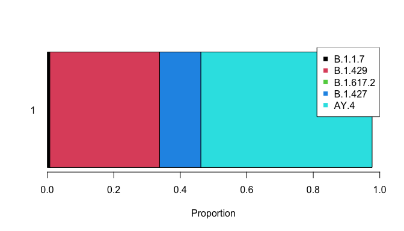
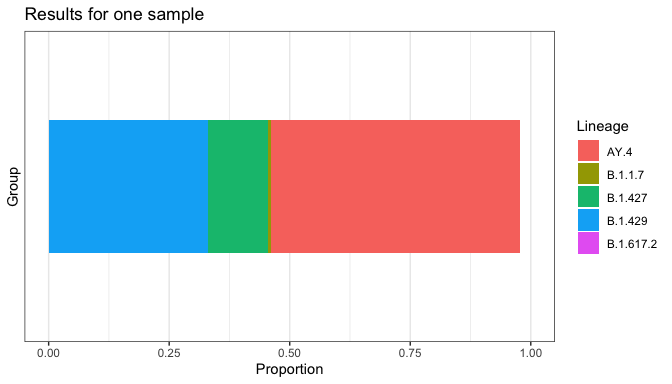
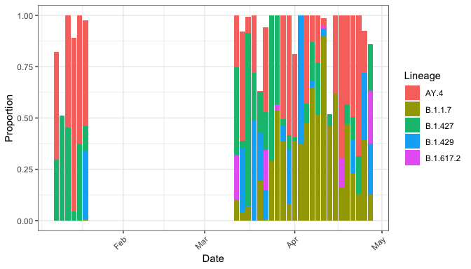
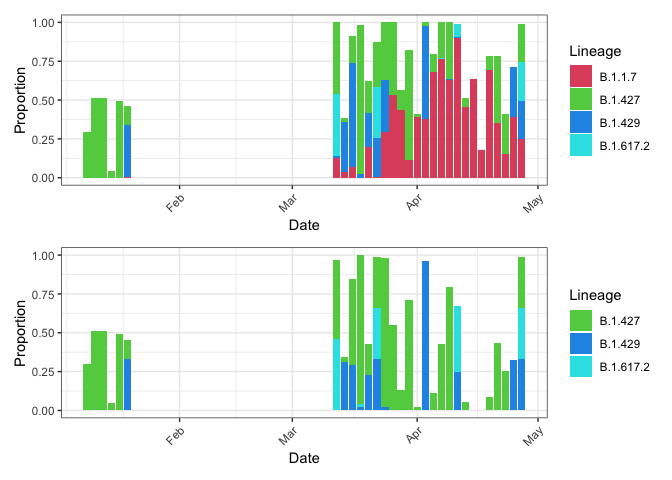

# ProVoC

[](https://lifecycle.r-lib.org/articles/stages.html#experimental-1)
[](https://opensource.org/licenses/MIT)

PROportions of Variants of Concern using counts, coverage, and a variant
matrix.

Builds and diagnoses a model based on:

- Counts: The number of times a given mutation was observed.
- Coverage: The number of times the position of a given variant was
  read.
- Mutation names: whatever format you want, as long as they match the
  names in the Variant Matrix.
- Variant Matrix: A matrix where the row names are variants, the column
  names are mutations, and the entries are 1 if the row variant has the
  column mutation and 0 otherwise.
  - For example: Usher Barcodes
  - All current methods accept fractional entries.

# Usage

There are two steps to using this software: create the mutation
definitions and run the model(s).

If not specified, the mutation definitions uses hardcoded definitions
from the
[cov-lineages/constellations](https://github.com/cov-lineages/constellations)
repo, which contains the representative mutations that were identified
by the PANGO team. The mutation definitions must have names that match
what exists in the data.

``` r
library(provoc)
data(Baaijens)
b1 <- Baaijens [Baaijens$sra == Baaijens$sra[1], ]
b1$mutation <- parse_mutations(b1$label)

head(b1[, c("count", "coverage", "mutation", "label")])
```

      count coverage        mutation   label
    1 14458    14818      aa:S:D614G ~23403G
    2 10431    32699         C12025T ~12025T
    3   759     9577         G29266A ~29266A
    4 23329    23690  aa:orf1a:T265I  ~1059T
    5  6935    32631       aa:M:R44S ~26654T
    6 13866    27715 aa:orf1a:L3352F ~10319T

The main fitting function is designed to mimic `glm()`, with formula
notation that emphasizes the connection to binomial GLM models. The
`bootstrap_samples` argument is optional, and is used to calculate
confidence intervals and correlation of the parameters.

``` r
res <- provoc(cbind(count, coverage) ~ B.1.1.7 + B.1.429 + B.1.617.2 + B.1.427 + AY.4 + P.1,
    data = b1,
    verbose = FALSE,
    bootstrap_samples = 100)
res
```

    Call: cbind(count, coverage) ~ B.1.1.7 + B.1.429 + B.1.617.2 + B.1.427 + 
        AY.4 + P.1

    Mutations in lineage definitions:  325 
    Mutations used in analysis/mutations in data:
    74/772

    All models converged.

    Top 4 variants:
         rho   ci_low  ci_high   variant group
    2   0.33 3.23e-01 3.39e-01   B.1.429     1
    4  0.124 1.16e-01 1.31e-01   B.1.427     1
    1  0.008 7.06e-03 8.14e-03   B.1.1.7     1
    3 <0.001 2.02e-09 4.67e-05 B.1.617.2     1

We have created a class for `provoc` objects with convenient methods.
For example, plotting the results is achieved as follows:

``` r
plot(res)
```



We use the convention of
[`autoplot()`](https://ggplot2.tidyverse.org/reference/autoplot.html) as
a function that creates a `ggplot2` plot based on a particular type of
data. This allows for all of `ggplot2`’s fanciness on top of a pre-made
plot.

``` r
library(ggplot2)
autoplot(res) +
    theme_bw() +
    labs(title = "Results for one sample")
```



# Multiple Samples

``` r
# First two samples from Baaijens
b2 <- Baaijens [Baaijens$sra %in% unique(Baaijens$sra)[1:30], ]
b2$mutations <- parse_mutations(b2$label)
head(b1[, c("count", "coverage", "mutation", "label", "sra")])
```

      count coverage        mutation   label         sra
    1 14458    14818      aa:S:D614G ~23403G SRR15505102
    2 10431    32699         C12025T ~12025T SRR15505102
    3   759     9577         G29266A ~29266A SRR15505102
    4 23329    23690  aa:orf1a:T265I  ~1059T SRR15505102
    5  6935    32631       aa:M:R44S ~26654T SRR15505102
    6 13866    27715 aa:orf1a:L3352F ~10319T SRR15505102

Note the “`by`” argument below. This tells `provoc()` to fit the model
separately to each sample defined by the `by` column. Since there are 50
samples, the model takes a while to run, hence why there are only 50
bootstrap samples here.

``` r
system.time(
    res <- provoc(cbind(count, coverage) ~ B.1.1.7 + B.1.429 + B.1.617.2 + B.1.427 + AY.4 + P.1,
        data = b2, by = "sra",
        verbose = FALSE, bootstrap_samples = 50)
)
```
       user  system elapsed 
     27.626   0.078  28.001 

``` r
res
```

    Call: cbind(count, coverage) ~ B.1.1.7 + B.1.429 + B.1.617.2 + B.1.427 + 
        AY.4 + P.1

    Mutations in lineage definitions:  325 
    Summary of percent of mutations used:
       Min. 1st Qu.  Median    Mean 3rd Qu.    Max. 
    0.09585 0.09585 0.09585 0.09585 0.09585 0.09585 


    All models converged.

    Top 6 variants:
          rho ci_low ci_high variant       group avg_spot_len sample_name     bases
    108 0.956  0.946   0.966 B.1.427 SRR15505128          302         FH1 417245918
    49  0.898  0.856   0.944 B.1.1.7 SRR15505114          302         FX2 385650980
    61  0.766  0.765   0.772 B.1.1.7 SRR15505117          302         FU2 651084518
    80  0.709  0.699   0.714 B.1.427 SRR15505121          302         FP1 568356752
    33  0.696  0.686   0.705 B.1.1.7 SRR15505110          302         GC3 462319720
    65  0.683  0.678   0.687 B.1.1.7 SRR15505118          302         FS3 609182622
         bioproject       date
    108 PRJNA741211 2021-03-18
    49  PRJNA741211 2021-04-11
    61  PRJNA741211 2021-04-07
    80  PRJNA741211 2021-03-30
    33  PRJNA741211 2021-04-19
    65  PRJNA741211 2021-04-05

The plotting functions above work as expected.

``` r
plot(res)
```


``` r
autoplot(res)
```


In addition, we’ve added special functionality for data with a “date”
column:

``` r
theme_set(theme_bw())
res$date <- lubridate::ymd(res$date)
autoplot(res, date_col = "date")
```



## Searching for Different Variants

``` r
library(patchwork)
res_with <- provoc(cbind(count, coverage) ~ B.1.1.7 + B.1.429 + B.1.617.2 + B.1.427,
    data = b2, by = "sra",
    verbose = FALSE, bootstrap_samples = 0)
res_with$date <- lubridate::ymd(res_with$date)

res_without <- provoc(cbind(count, coverage) ~ B.1.429 + B.1.617.2 + B.1.427,
    data = b2, by = "sra",
    verbose = FALSE, bootstrap_samples = 0)
res_without$date <- lubridate::ymd(res_without$date)

g_with <- autoplot(res_with, date_col = "date") +
    scale_fill_manual(values = 2:5)
g_without <- autoplot(res_without, date_col = "date") +
    scale_fill_manual(values = 3:5)

g_with / g_without
```



# Roadmap

- Soon
  - [ ] Finish approximations to Freyja and Alcov.
  - [ ] Full suite of model diagnostics.
  - [ ] Process data from iVar for use in models.
  - [ ] Tools to investigate the effect of different lineage
    definitions.
- Medium future
  - [ ] Convert Freyja and Alcov outputs to R objects that can take
    advantage of the diagnostics.
  - [ ] Hypothesis tests for whether a coefficient (or group) is 0.
- Far future
  - [ ] Make available on CRAN
